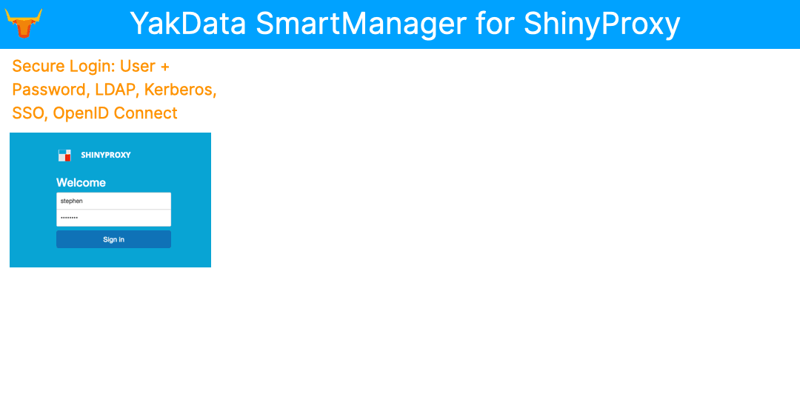

# YakData SmartManager for ShinyProxy
## The production-ready way to securely share R shiny web apps & RMarkdown docs. Includes R 4.1.1, server-based RStudio IDE, monitoring of containers via Grafana dashboards & free SSL renewal.

  - [🚀 Features](#-features)
  - [🧰 Install and setup 🔒 SSL/TLS](#-install-and-setup--ssltls)
  - [🔐 LICENSE](#-license)
  - [⭐ Inspiration](#-inspiration)
  - [📫 Issues](#-issues)
  - [📘 Docs](#-docs)
  - [🎡 Alternatives](#-alternatives)
  - [🧑‍💻 Discussion](#-discussion)
  

## 🚀 Features

* YakData SmartManager for ShinyProxy on AWS is the production-ready way to efficiently publish your interactive R shiny web applications, R Markdown reports & R shiny dashboards, enabling you to securely share your analyses with colleagues & clients.
* Save weeks of time to get up and running with a complete solution and continue saving days of update time with YakData SmartManager for ShinyProxy.
* ShinyProxy supports a wide range of authentication methods including native user/password authentication, LDAP, Kerberos, SSO, OpenID Connect, SAML 2.0, Twitter, Facebook, Google, Github,  LinkedIn, custom web service-based or open to the public.
* Includes R 4.1.1 based on the Rocker project and  server-based RStudio IDE onboard so that admins can easily install new libraries and debug R shiny programs. 
* Monitoring via Grafana,Prometheus and CAdvisor for real-time dashboards at the container level

## 🧰 Install and setup 🔒 SSL/TLS

Complete all the steps in /yakdata/INSTALL.md
Then complete all steps in /yakdata/SSL_SETUP.md
Alternatively, use the AWS AMI from YakData.

## 🔐 LICENSE

**The YUMMY License**
**A sustainable, open-source license**

The YUMMY approach is an innovative model to create sustainable, open-source projects that are mutually beneficial to creators, builders and users. YoU make Money, we make MoneY, if you don't make money using it, you may use the Software for free. Refer to /yakdata/LICENSE_v1.1.md for the complete license.

## ⭐ Inspiration

* ShinyProxy is a affordable, powerful alternative to paid offerings such as RStudio Shiny Server Pro and part of RStudio Connect capabilities.
* ShinyProxy is a proven alternative with years of development, feedback and releases.
* We experienced ShinyProxy at some of our client engagements and saw the enthusiasm from companies using it.

If you love this project, please give it a ⭐.

## 📫 Issues

Please share issues here in this repository [Issues](https://github.com/yakdata/smartmanager-for-shinyproxy/issues).

## 📘 Docs

ShinyProxy docs: https://www.shinyproxy.io/documentation/

RStudio IDE repository: https://github.com/rstudio/rstudio

Grafana docs: https://grafana.com/docs/

## 🎡 Alternatives

Alternatives include RStudio Shiny Server Pro and a subset of the RStudio Connect capabilities.

Another alternative is roll-your-own security model around open source Shiny Server.

## 🧑‍💻 Discussion

Head over to [The YakData Community](https://meta.yakdata.com). You can login to comment with your Github account, a Google account or your email and a password.

