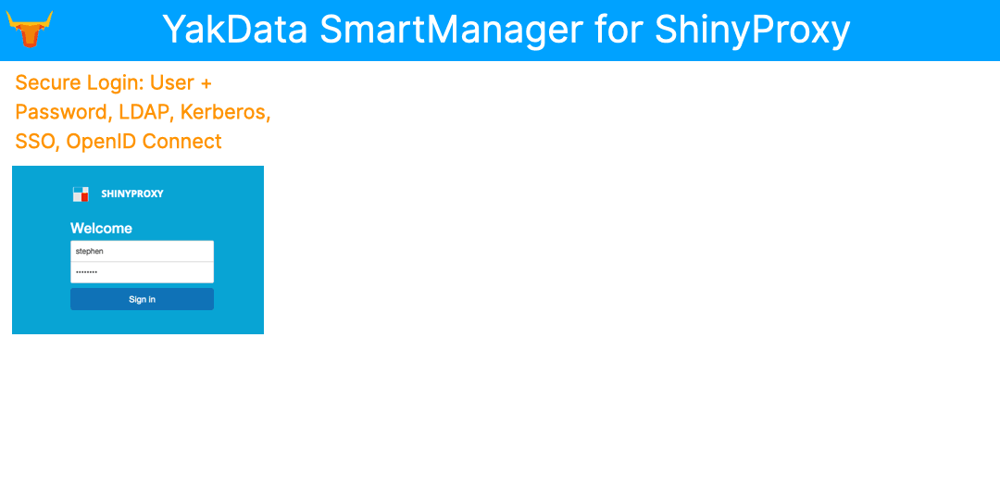
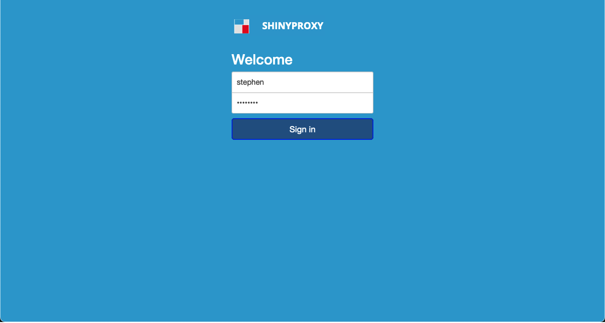
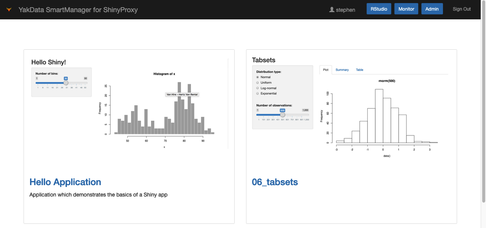
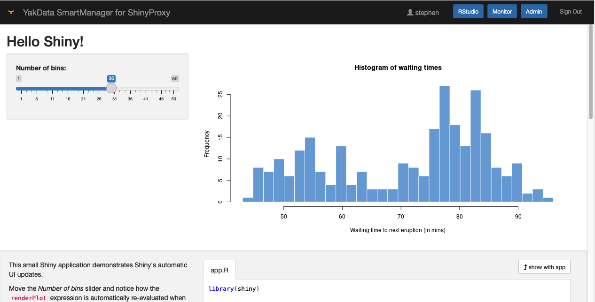
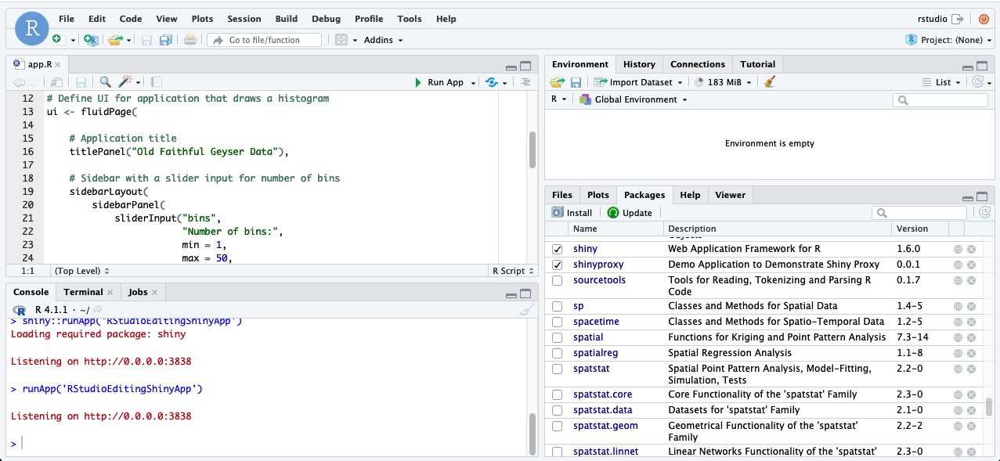
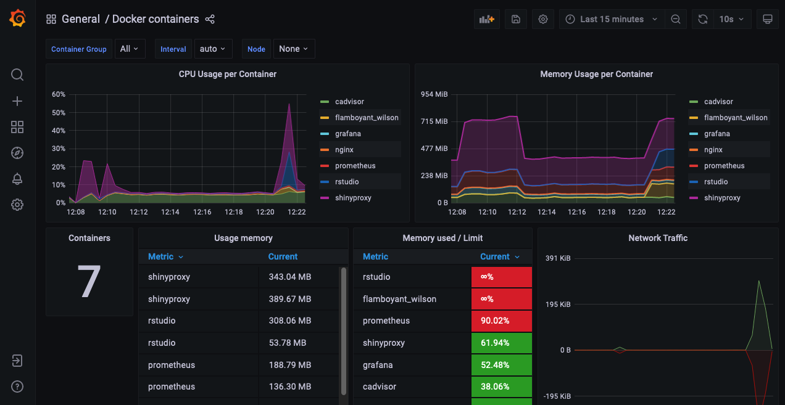
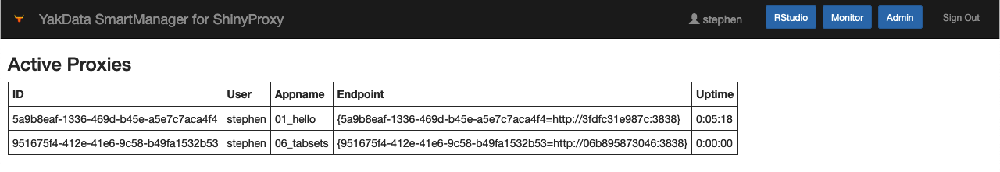

# YakData SmartManager for ShinyProxy

The production-ready way to securely share R shiny web apps &amp; RMarkdown documents. <strong>Free</strong> under the Apache 2.0 license.<br><br>YakData SmartManager for ShinyProxy includes R 4.1.3, server-based RStudio IDE, monitoring of containers via Grafana dashboards &amp; free SSL renewal.<br><br>Deploy the complete solution in minutes with the <a href="https://aws.amazon.com/marketplace/pp/prodview-de7oj4x576blg">AWS Marketplace AMI from YakData</a>. Or do-it-yourself here on GitHub.<br>&nbsp;



---
  - [🚀 Features](#-features)
  - [📷 Screenshots](#-screenshots)
  - [🧰 Install and setup 🔒 SSL/TLS](#-install-and-setup--ssltls)
  - [🔐 LICENSE](#-license)
  - [⭐ Inspiration](#-inspiration)
  - [📫 Issues](#-issues)
  - [📘 Docs](#-docs)
  - [🎡 Alternatives](#-alternatives)
  - [🧑‍💻 Discussion](#-discussion)
  - [⛳ Availability](#-availability)
  - [🌵 Directory Structure](#-directory-structure)
  - [🎉 About YakData](#-about-yakdata)

## 🚀 Features

* YakData SmartManager for ShinyProxy on AWS is the production-ready way to efficiently publish your interactive R shiny web applications, R Markdown reports & R shiny dashboards, enabling you to securely share your analyses with colleagues and clients.
* Save weeks of time to get up and running with a complete solution and continue saving days of update time with YakData SmartManager for ShinyProxy.
* ShinyProxy supports a wide range of authentication methods including native user/password authentication, LDAP, Kerberos, SSO, OpenID Connect, SAML 2.0, Twitter, Facebook, Google, Github,  LinkedIn, custom web service-based or open to the public.
* Includes R 4.1.3 based on the Rocker project and server-based RStudio IDE onboard so that admins can easily install new libraries and debug R shiny programs. 
* Monitoring via Grafana, Prometheus and CAdvisor for real-time dashboards at the container level
* Deploy the complete solution in minutes <a href="https://aws.amazon.com/marketplace/pp/prodview-de7oj4x576blg" target="_blank">with the AWS Marketplace AMI from YakData</a>. We choose to appear on the AWS Marketplace since they require all AMI's go through stringent architecture and security checks before appearing on their Marketplace. And at many organizations, AWS is already an approved vendor, simplifying your job all-around!

## 📷 Screenshots

- Login


- Home page


- R shiny app example


- RStudio IDE


- Grafana monitoring with Prometheus and CAdvisor


- Standard ShinyProxy admin page


## 🧰 Install and setup 🔒 SSL/TLS

The quickest, easiest deployment path is to use the [AWS AMI from YakData](https://aws.amazon.com/marketplace/pp/prodview-de7oj4x576blg).

Alternatively, to do it yourself, complete all the steps in [/yakdata/INSTALL.md](https://github.com/Stephen-McDaniel/SmartManager-for-ShinyProxy/blob/master/INSTALL.md)

Finally, setup your SSL by completing all steps in [/yakdata/SSL_SETUP.md](https://github.com/Stephen-McDaniel/SmartManager-for-ShinyProxy/blob/master/SSL_SETUP.md)

## 🔐 LICENSE

Licensed under the Apache License, Version 2.0 (the "License"); you may not use this file except in compliance with the License. You may obtain a copy of the License at

http://www.apache.org/licenses/LICENSE-2.0

Unless required by applicable law or agreed to in writing, software distributed under the License is distributed on an "AS IS" BASIS, WITHOUT WARRANTIES OR CONDITIONS OF ANY KIND, either express or implied. See the License for the specific language governing permissions and limitations under the License.

This license change is retroactive to all releases up until this change.

## ⭐ Inspiration

* ShinyProxy is a **free**, powerful alternative to paid offerings such as RStudio Shiny Server Pro and part of RStudio Connect capabilities.
* ShinyProxy is a proven alternative with years of development, feedback and releases.
* We experienced ShinyProxy at some of our client engagements and saw the enthusiasm from companies using it.

If you benefit from this project, please give it a ⭐ here on GitHub. You are awesome for sharing your support!

## 📫 Issues

Please share issues here in this repository [Issues](https://github.com/Stephen-McDaniel/SmartManager-for-ShinyProxy/issues).

## 📘 Docs

ShinyProxy docs: https://www.shinyproxy.io/documentation/

RStudio IDE repository: https://github.com/rstudio/rstudio

Grafana docs: https://grafana.com/docs/


## 🎡 Alternatives

Alternatives include RStudio Shiny Server Pro and a subset of the RStudio Connect capabilities.

Another alternative is roll-your-own security model around open source Shiny Server.

## 🧑‍💻 Discussion

Head over to [The YakData Community](https://meta.yakdata.com). You can login to comment with your Github account, a Google account or your email and a password.

## ⛳ Availability

Deploy the complete solution in minutes <a href="https://aws.amazon.com/marketplace/pp/prodview-de7oj4x576blg" target="_blank">with the AWS Marketplace AMI from YakData</a>. We choose to appear on the AWS Marketplace since they require all AMI's go through stringent architecture and security checks before appearing on their Marketplace. And at many organizations, AWS is already an approved vendor, simplifying your job all-around!

Do-it-yourself on GitHub.

## 🌵 Directory Structure

```
├── 001_Login_YakData_SmartManager_for_ShinyProxy.png
├── 002_home_page_YakData_SmartManager_for_ShinyProxy.png
├── 003_R_shiny_app_YakData_SmartManager_for_ShinyProxy.png
├── 004_RStudio_IDE_YakData_SmartManager_for_ShinyProxy.png
├── 005_Grafana_Prometheus_CAdvisor_Monitorring_YakData_SmartManager_for_ShinyProxy.png
├── 006_standard_ShinyProxy_admin_page_YakData_SmartManager_for_ShinyProxy.png
├── INSTALL.md
├── LICENSE.md
├── README.md
├── SSL_SETUP.md
├── YakData-SmartManager-for-ShinyProxy.gif
└── yakdata
    ├── apps
    │   ├── docker-compose.yml
    │   ├── nginx
    │   │   └── 1.21.3
    │   │       ├── Dockerfile
    │   │       └── scripts
    │   │           ├── 10-listen-on-ipv6-by-default.sh
    │   │           ├── 20-envsubst-on-templates.sh
    │   │           ├── 30-tune-worker-processes.sh
    │   │           └── docker-entrypoint.sh
    │   └── shinyproxy
    │       └── 2.5.0
    │           └── Dockerfile
    ├── config
    │   ├── R
    │   │   └── Rprofile.site
    │   ├── grafana
    │   │   ├── defaults.ini
    │   │   └── provisioning
    │   │       ├── dashboards
    │   │       │   ├── dashboard.yml
    │   │       │   └── docker_containers.json
    │   │       └── datasources
    │   │           └── datasource.yml
    │   ├── licensekeys
    │   │   └── licensekey.txt
    │   ├── nginx
    │   │   ├── nginx.conf
    │   │   └── templates
    │   │       └── default.conf.conf
    │   ├── prometheus
    │   │   └── prometheus.yml
    │   └── shinyproxy
    │       ├── application.yml
    │       └── templates
    │           └── yakdata
    │               ├── admin.html
    │               ├── app-access-denied.html
    │               ├── app.html
    │               ├── assets
    │               │   ├── css
    │               │   │   ├── 2-col-portfolio.css
    │               │   │   ├── default.css
    │               │   │   ├── error.css
    │               │   │   └── login.css
    │               │   ├── img
    │               │   │   ├── 01_hello.png
    │               │   │   ├── 06_tabsets.png
    │               │   │   └── loading.gif
    │               │   └── js
    │               │       └── new_version_check.js
    │               ├── auth-error.html
    │               ├── error.html
    │               ├── fragments
    │               │   └── navbar.html
    │               ├── index.html
    │               ├── login.html
    │               └── logout-success.html
    ├── utilities
    │   ├── acme
    │   │   ├── ycustcontrol
    │   │   │   └── admin_server_specific
    │   │   │       └── acme.sh
    │   │   │           ├── account.conf
    │   │   │           ├── ca
    │   │   │           │   └── acme-v02.api.letsencrypt.org
    │   │   │           │       ├── account.json
    │   │   │           │       └── ca.conf
    │   │   │           └── http.header
    │   │   └── ydeploy
    │   │       ├── code
    │   │       │   └── acme
    │   │       │       ├── Dockerfile
    │   │       │       ├── LICENSE.md
    │   │       │       ├── README.md
    │   │       │       ├── acme.sh
    │   │       │       ├── deploy
    │   │       │       │   ├── README.md
    │   │       │       │   ├── apache.sh
    │   │       │       │   ├── cleverreach.sh
    │   │       │       │   ├── consul.sh
    │   │       │       │   ├── cpanel_uapi.sh
    │   │       │       │   ├── docker.sh
    │   │       │       │   ├── dovecot.sh
    │   │       │       │   ├── exim4.sh
    │   │       │       │   ├── fritzbox.sh
    │   │       │       │   ├── gcore_cdn.sh
    │   │       │       │   ├── gitlab.sh
    │   │       │       │   ├── haproxy.sh
    │   │       │       │   ├── keychain.sh
    │   │       │       │   ├── kong.sh
    │   │       │       │   ├── lighttpd.sh
    │   │       │       │   ├── mailcow.sh
    │   │       │       │   ├── myapi.sh
    │   │       │       │   ├── mydevil.sh
    │   │       │       │   ├── mysqld.sh
    │   │       │       │   ├── nginx.sh
    │   │       │       │   ├── opensshd.sh
    │   │       │       │   ├── openstack.sh
    │   │       │       │   ├── panos.sh
    │   │       │       │   ├── peplink.sh
    │   │       │       │   ├── pureftpd.sh
    │   │       │       │   ├── qiniu.sh
    │   │       │       │   ├── routeros.sh
    │   │       │       │   ├── ssh.sh
    │   │       │       │   ├── strongswan.sh
    │   │       │       │   ├── synology_dsm.sh
    │   │       │       │   ├── unifi.sh
    │   │       │       │   ├── vault.sh
    │   │       │       │   ├── vault_cli.sh
    │   │       │       │   └── vsftpd.sh
    │   │       │       ├── dnsapi
    │   │       │       │   ├── README.md
    │   │       │       │   ├── dns_1984hosting.sh
    │   │       │       │   ├── dns_acmedns.sh
    │   │       │       │   ├── dns_acmeproxy.sh
    │   │       │       │   ├── dns_active24.sh
    │   │       │       │   ├── dns_ad.sh
    │   │       │       │   ├── dns_ali.sh
    │   │       │       │   ├── dns_anx.sh
    │   │       │       │   ├── dns_arvan.sh
    │   │       │       │   ├── dns_aurora.sh
    │   │       │       │   ├── dns_autodns.sh
    │   │       │       │   ├── dns_aws.sh
    │   │       │       │   ├── dns_azion.sh
    │   │       │       │   ├── dns_azure.sh
    │   │       │       │   ├── dns_cf.sh
    │   │       │       │   ├── dns_clouddns.sh
    │   │       │       │   ├── dns_cloudns.sh
    │   │       │       │   ├── dns_cn.sh
    │   │       │       │   ├── dns_conoha.sh
    │   │       │       │   ├── dns_constellix.sh
    │   │       │       │   ├── dns_cx.sh
    │   │       │       │   ├── dns_cyon.sh
    │   │       │       │   ├── dns_da.sh
    │   │       │       │   ├── dns_ddnss.sh
    │   │       │       │   ├── dns_desec.sh
    │   │       │       │   ├── dns_df.sh
    │   │       │       │   ├── dns_dgon.sh
    │   │       │       │   ├── dns_dnsimple.sh
    │   │       │       │   ├── dns_do.sh
    │   │       │       │   ├── dns_domeneshop.sh
    │   │       │       │   ├── dns_dp.sh
    │   │       │       │   ├── dns_dpi.sh
    │   │       │       │   ├── dns_dreamhost.sh
    │   │       │       │   ├── dns_duckdns.sh
    │   │       │       │   ├── dns_durabledns.sh
    │   │       │       │   ├── dns_dyn.sh
    │   │       │       │   ├── dns_dynv6.sh
    │   │       │       │   ├── dns_easydns.sh
    │   │       │       │   ├── dns_edgedns.sh
    │   │       │       │   ├── dns_euserv.sh
    │   │       │       │   ├── dns_exoscale.sh
    │   │       │       │   ├── dns_freedns.sh
    │   │       │       │   ├── dns_gandi_livedns.sh
    │   │       │       │   ├── dns_gcloud.sh
    │   │       │       │   ├── dns_gd.sh
    │   │       │       │   ├── dns_gdnsdk.sh
    │   │       │       │   ├── dns_he.sh
    │   │       │       │   ├── dns_hetzner.sh
    │   │       │       │   ├── dns_hexonet.sh
    │   │       │       │   ├── dns_hostingde.sh
    │   │       │       │   ├── dns_huaweicloud.sh
    │   │       │       │   ├── dns_infoblox.sh
    │   │       │       │   ├── dns_infomaniak.sh
    │   │       │       │   ├── dns_internetbs.sh
    │   │       │       │   ├── dns_inwx.sh
    │   │       │       │   ├── dns_ionos.sh
    │   │       │       │   ├── dns_ispconfig.sh
    │   │       │       │   ├── dns_jd.sh
    │   │       │       │   ├── dns_joker.sh
    │   │       │       │   ├── dns_kappernet.sh
    │   │       │       │   ├── dns_kas.sh
    │   │       │       │   ├── dns_kinghost.sh
    │   │       │       │   ├── dns_knot.sh
    │   │       │       │   ├── dns_leaseweb.sh
    │   │       │       │   ├── dns_lexicon.sh
    │   │       │       │   ├── dns_linode.sh
    │   │       │       │   ├── dns_linode_v4.sh
    │   │       │       │   ├── dns_loopia.sh
    │   │       │       │   ├── dns_lua.sh
    │   │       │       │   ├── dns_maradns.sh
    │   │       │       │   ├── dns_me.sh
    │   │       │       │   ├── dns_miab.sh
    │   │       │       │   ├── dns_misaka.sh
    │   │       │       │   ├── dns_myapi.sh
    │   │       │       │   ├── dns_mydevil.sh
    │   │       │       │   ├── dns_mydnsjp.sh
    │   │       │       │   ├── dns_namecheap.sh
    │   │       │       │   ├── dns_namecom.sh
    │   │       │       │   ├── dns_namesilo.sh
    │   │       │       │   ├── dns_nederhost.sh
    │   │       │       │   ├── dns_neodigit.sh
    │   │       │       │   ├── dns_netcup.sh
    │   │       │       │   ├── dns_netlify.sh
    │   │       │       │   ├── dns_nic.sh
    │   │       │       │   ├── dns_njalla.sh
    │   │       │       │   ├── dns_nm.sh
    │   │       │       │   ├── dns_nsd.sh
    │   │       │       │   ├── dns_nsone.sh
    │   │       │       │   ├── dns_nsupdate.sh
    │   │       │       │   ├── dns_nw.sh
    │   │       │       │   ├── dns_oci.sh
    │   │       │       │   ├── dns_one.sh
    │   │       │       │   ├── dns_online.sh
    │   │       │       │   ├── dns_openprovider.sh
    │   │       │       │   ├── dns_openstack.sh
    │   │       │       │   ├── dns_ovh.sh
    │   │       │       │   ├── dns_pdns.sh
    │   │       │       │   ├── dns_pleskxml.sh
    │   │       │       │   ├── dns_pointhq.sh
    │   │       │       │   ├── dns_porkbun.sh
    │   │       │       │   ├── dns_rackcorp.sh
    │   │       │       │   ├── dns_rackspace.sh
    │   │       │       │   ├── dns_rcode0.sh
    │   │       │       │   ├── dns_regru.sh
    │   │       │       │   ├── dns_scaleway.sh
    │   │       │       │   ├── dns_schlundtech.sh
    │   │       │       │   ├── dns_selectel.sh
    │   │       │       │   ├── dns_servercow.sh
    │   │       │       │   ├── dns_simply.sh
    │   │       │       │   ├── dns_tele3.sh
    │   │       │       │   ├── dns_transip.sh
    │   │       │       │   ├── dns_ultra.sh
    │   │       │       │   ├── dns_unoeuro.sh
    │   │       │       │   ├── dns_variomedia.sh
    │   │       │       │   ├── dns_veesp.sh
    │   │       │       │   ├── dns_vscale.sh
    │   │       │       │   ├── dns_vultr.sh
    │   │       │       │   ├── dns_websupport.sh
    │   │       │       │   ├── dns_world4you.sh
    │   │       │       │   ├── dns_yandex.sh
    │   │       │       │   ├── dns_zilore.sh
    │   │       │       │   ├── dns_zone.sh
    │   │       │       │   └── dns_zonomi.sh
    │   │       │       └── notify
    │   │       │           ├── cqhttp.sh
    │   │       │           ├── dingtalk.sh
    │   │       │           ├── ifttt.sh
    │   │       │           ├── mail.sh
    │   │       │           ├── mailgun.sh
    │   │       │           ├── pop.sh
    │   │       │           ├── postmark.sh
    │   │       │           ├── pushbullet.sh
    │   │       │           ├── pushover.sh
    │   │       │           ├── sendgrid.sh
    │   │       │           ├── slack.sh
    │   │       │           ├── smtp.sh
    │   │       │           ├── teams.sh
    │   │       │           ├── telegram.sh
    │   │       │           └── xmpp.sh
    │   │       └── docker-compose.yml
    │   ├── etc_cron.d
    │   │   └── checkagerenewssl
    │   └── scripts
    │       ├── checkagerenewssl.sh
    │       ├── licensekeycheck.sh
    │       └── renewssl.sh
    └── webassets
        ├── custom
        │   └── 403.html
        ├── images
        │   ├── OpenAnalyticsShinyProxy.png
        │   ├── YakData_Logo_20171101_S_36_36.png.webp
        │   └── favicon.ico
        ├── license.status
        └── scripts
            └── licensecheck.js

44 directories, 236 files
```

## 🎉 About YakData

[YakData](https://yakdata.com/) is an agile forecasting firm delivering critical-path forecasts for new products, product acquisition, ad growth and sales force expansion to scale and grow your business. 

We build strategic forecasts for your business based on modern, advanced analytic languages and modular data stacks that are quick to develop and share with key stakeholders in your business.

[Successful projects](https://yakdata.com/success) have included forecasting new customer revenue by marketing channel at a leading subscription business, planning a 9-figure acquisition and investment decision at a leading biotech company, optimizing online ad-spend at a leading billion-dollar retailer, building mix-model multi-channel marketing forecasts at a multi-billion dollar video platform and estimating customer lifetime value in real-time at a leading online streaming business.

When you [hire YakData](https://yakdata.com/pricing/), our principals perform the majority of your high-value project work. Our primary mission is to be your trusted confidante as you make critical business investments and decisions. We deliver results that are presentation-ready for executive teams, boards of directors and key investors.
